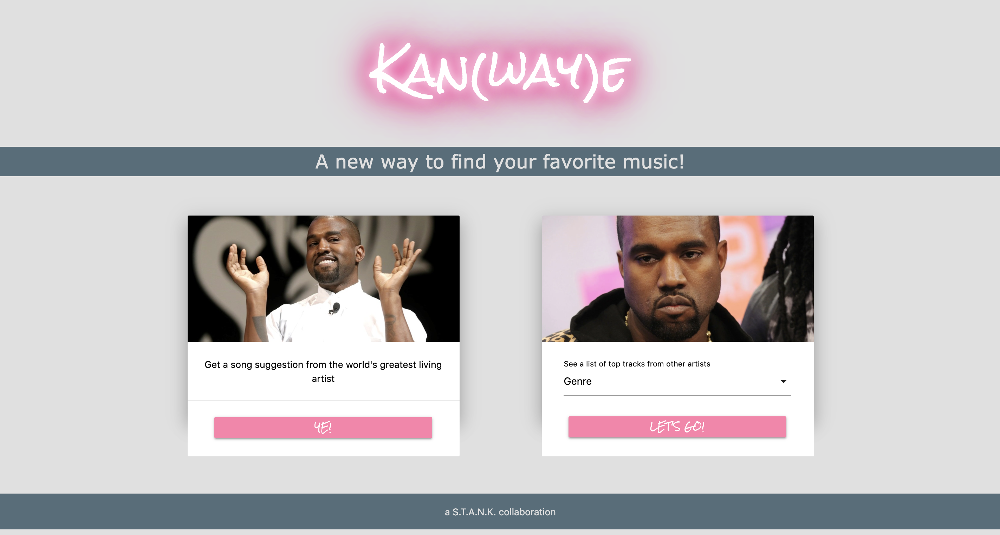
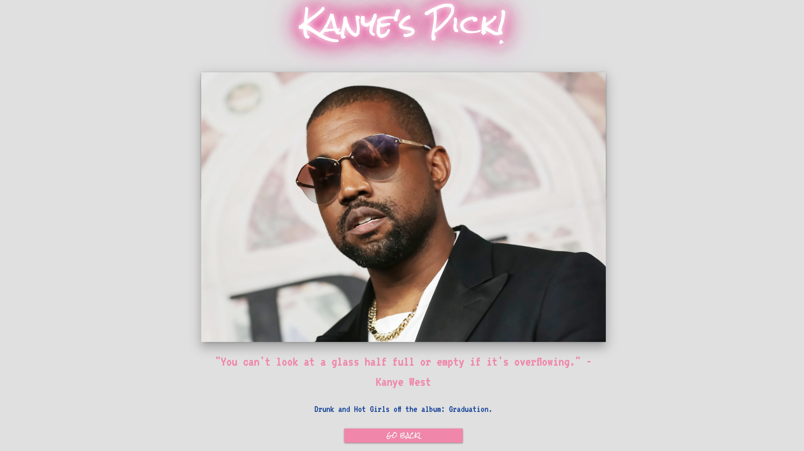
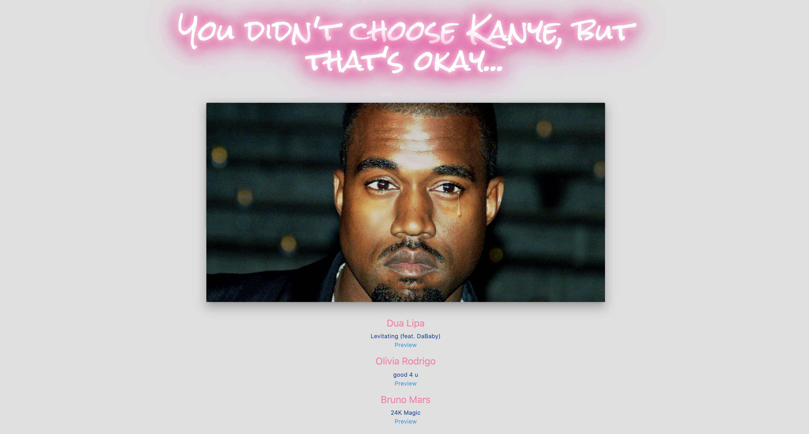
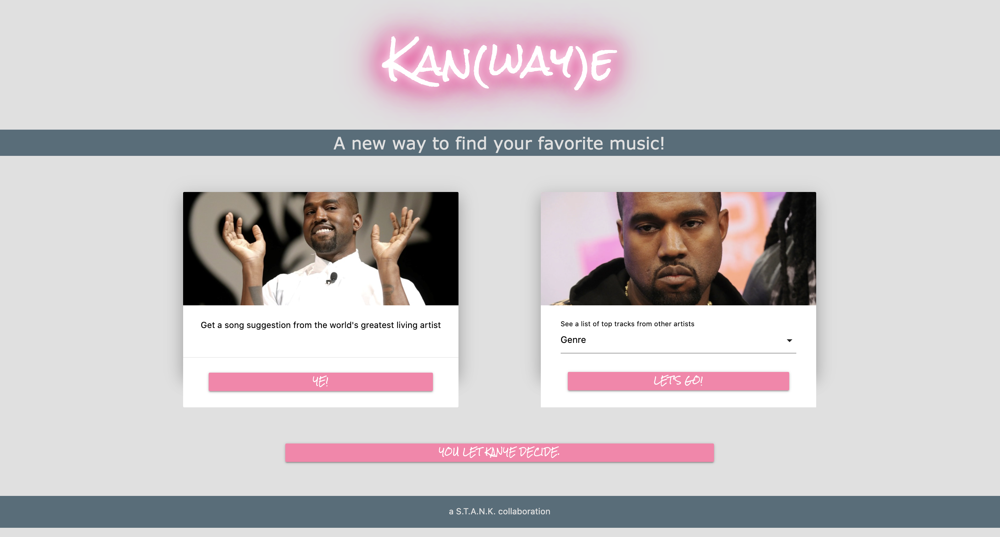

# Kan(way)e - A new way to find your favorite music!

Deployed Website URL: https://kelley-mcd.github.io/STANK-Music/

Github Page: https://github.com/kelley-mcd/STANK-Music


In this project we will work together as a group to build an application that searches and displays results from the Napster and Kanye.rest APIs.

# User Story
```
AS A User I am interested in looking for music to listen to
I WANT a new way to get a Kanye song suggestion or get a list of songs/artist for a specific Genre
SO THAT I can minimize my time searching for a song and find my favorite music. 
```

# Acceptance Criteria
```
GIVEN I want a new way to find my favorite music,
WHEN I navigate to the Homepage
THEN I am presented with an option to get a Kanye's suggestion or select a Genre
WHEN I click the YE! button
THEN I am presented with a picture of Kanye, a Kanye inspired quote, 
a Kanye Song and the Album the song is from
WHEN I select a Genre and click on Let's Go!
THEN I am presented with a sad Kanye picture and a list of song recommendation 
of other artist, along with a preview of each song
WHEN I click on the Go Back button
THEN I am taken back to the Homepage and a recent search history is shown
When I click on the recent search button
THEN I am taken back to the page I had chosen 
```

# Tools and API Used
```
Napster API- https://developer.napster.com/api/v2.2
Kanye.rest API - https://github.com/ajzbc/kanye.rest
Materialized - https://materializecss.com/
jQuery - https://code.jquery.com/
Google Fonts - https://fonts.google.com/
Trello - https://trello.com
Lucid - https://www.lucidchart.com/
```

# a S.T.A.N.K collaboration

Collaboration between https://github.com/stevaniekanter, https://github.com/mrtbird539, https://github.com/AlexParker82, https://github.com/CIDoubleAgent, https://github.com/kelley-mcd

# Screenshot of Application
```
Homepage



Kanye suggestion page



Choose a genre, artist and song suggestion page



Homepage with search history


```